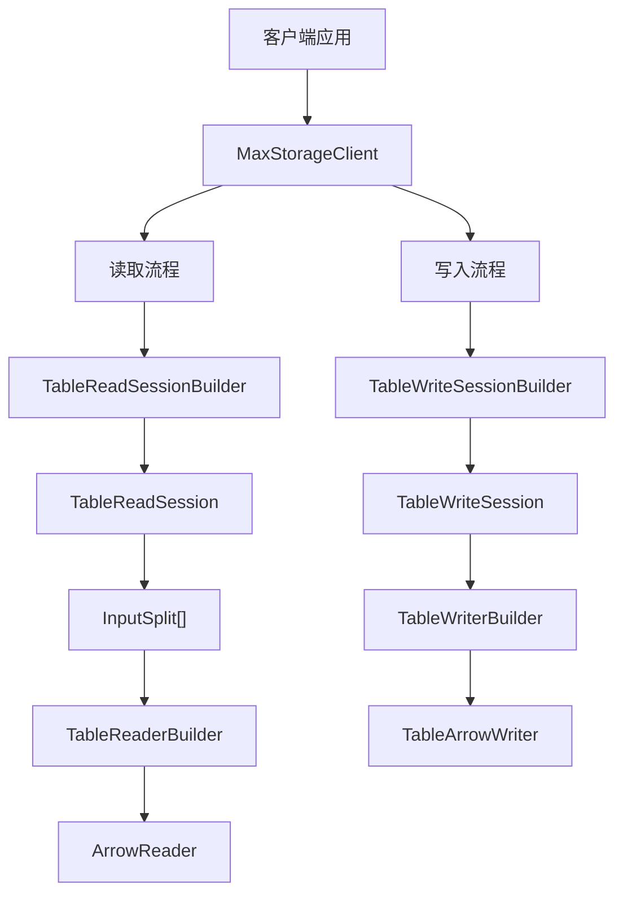

## 概述

MaxCompute Storage API 是专为高性能数据读写设计的接口，基于 [Apache Arrow](https://arrow.apache.org/) 列式内存格式，提供高效的数据传输能力。相比传统 Tunnel 接口，Storage API 具备更低的序列化开销和更好的并行处理能力，适合大规模数据批量导入导出场景。

## 核心特性

| 特性 | 说明 |
|------|------|
| **高性能** | 基于 Apache Arrow 列式格式，减少序列化/反序列化开销 |
| **并行读写** | 支持将数据切分为多个 Split，并行读取或写入 |
| **事务性写入** | 批量（Batch）模式下写入为原子操作，提交后才对外可见 |
| **流式写入** | Streaming 模式下数据 flush 后立即可见，无需显式提交 |
| **列裁剪** | 读取时可指定所需列，减少网络传输量 |
| **分区过滤** | 读取时可指定分区，按需加载数据 |
| **服务端过滤** | 支持下推过滤谓词，减少数据传输量 |
| **增量读取** | 支持增量读取模式，读取表数据的增量变化 |

## 架构概览



## 依赖引入

在项目的 `pom.xml` 中添加以下依赖：

```xml
<dependency>
    <groupId>com.aliyun.odps</groupId>
    <artifactId>odps-sdk-storage-api</artifactId>
    <version>${odps.sdk.version}</version>
</dependency>
```

## 快速开始

### 读取表数据

```java
// 1. 构建客户端
MaxStorageClient client = MaxStorageClient.builder()
    .endpoint("https://service.cn-hangzhou.maxcompute.aliyun.com/api")
    .credentialsProvider(credentialsProvider)
    .build();

// 2. 创建读取 Session
TableIdentifier tableId = TableIdentifier.of("my_project", "my_table");
TableReadSession session = client.createTableReadSessionBuilder(tableId)
    .withColumns(Arrays.asList("id", "name", "age"))
    .build();

// 3. 获取 Splits 并行读取
List<InputSplit> splits = session.getSplits();
for (InputSplit split : splits) {
    try (ArrowReader reader = session.createReaderBuilder(split).build()) {
        while (reader.loadNextBatch()) {
            VectorSchemaRoot root = reader.getVectorSchemaRoot();
            // 处理 Arrow 格式数据
            System.out.println("读取行数: " + root.getRowCount());
        }
    }
}
```

### 写入表数据（批量模式）

```java
// 1. 构建客户端
MaxStorageClient client = MaxStorageClient.builder()
    .endpoint("https://service.cn-hangzhou.maxcompute.aliyun.com/api")
    .credentialsProvider(credentialsProvider)
    .build();

// 2. 创建写入 Session（批量模式）
TableIdentifier tableId = TableIdentifier.of("my_project", "my_table");
try (TableWriteSession session = client.createTableWriteSessionBuilder(tableId).build()) {
    // 3. 创建 Writer
    try (ArrowWriter writer = session.createWriterBuilder("stream-1", 1).build()) {
        VectorSchemaRoot root = ((TableArrowWriter) writer).createVectorSchemaRoot();
        try {
            // 填充数据并写入
            // ... 填充 root 中的数据 ...
            writer.writeBatch(root);
            writer.flush();
        } finally {
            root.close();
        }
    }
    // 4. 提交事务，数据对外可见
    session.commit();
}
```

### 写入表数据（流式模式）

```java
TableIdentifier tableId = TableIdentifier.of("my_project", "my_table");
try (TableWriteSession session = client.createTableWriteSessionBuilder(tableId)
        .withWriteMode(WriteMode.STREAMING)
        .build()) {
    try (ArrowWriter writer = session.createWriterBuilder("stream-1", 1).build()) {
        // flush 后数据立即可见，无需 commit
        writer.writeBatch(root);
        writer.flush();
    }
    // Streaming 模式无需显式 commit
}
```

## 主要组件

| 组件 | 说明 |
|------|------|
| [`MaxStorageClient`](./client.md) | 客户端入口，线程安全，建议长期持有 |
| [`TableReadSessionBuilder`](./read.md#tablereadsessionbuilder) | 构建表读取 Session 的 Builder |
| [`TableReadSession`](./read.md#tablereadsession) | 表读取 Session，包含分片信息和 Schema |
| [`TableReaderBuilder`](./read.md#tablereaderbuilder) | 构建具体读取器的 Builder |
| [`TableWriteSessionBuilder`](./write.md#tablewritesessionbuilder) | 构建表写入 Session 的 Builder |
| [`TableWriteSession`](./write.md#tablewritesession) | 表写入 Session，管理事务生命周期 |
| [`TableWriterBuilder`](./write.md#tablewriterbuilder) | 构建 Arrow Writer 的 Builder |
| [`TableArrowWriter`](./write.md#tablearrowwriter) | Arrow 格式写入器 |
| [`BlobManager`](./blob.md#blobmanager-接口) | Blob 数据管理器，提供单条和批量下载 |

## 线程安全说明

- `MaxStorageClient`：**线程安全**，适合全局复用
- Session（`TableReadSession`、`TableWriteSession`）：**非线程安全**，每个操作使用独立实例
- Writer / Reader：**非线程安全**，每个线程独立使用

## 资源管理

所有 Session、Reader、Writer 均实现了 `AutoCloseable` 接口，推荐使用 `try-with-resources` 语法以确保资源正确释放：

```java
try (TableReadSession session = client.createTableReadSessionBuilder(tableId).build();
     ArrowReader reader = session.createReaderBuilder(splits.get(0)).build()) {
    // 使用 reader
}
// 自动关闭 reader 和 session
```
