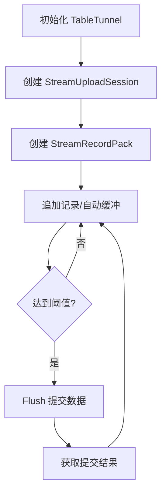

StreamUploadSession 作为 TableTunnel 的核心组件，是Stream Tunnel组件的一员部分。
与 [UploadSession](UploadSession.md) 不同的是，StreamUploadSession
专为流式数据上传场景而设计，支持写入即可见（auto-commit）特性，不需要用户手动提交会话。

## 使用流程


## 初始化配置
### 基础构造器
```java
// 最小化配置示例
StreamUploadSession session = tableTunnel.buildStreamUploadSession(projectName, tableName)
    .setSchemaName("user_logs")  // 三层模型
    .setPartitionSpec("dt=20231001/city=shanghai") // 分区表达式
    .build();
```

### 高级配置参数
| 构造器方法 | 类型 | 默认值 | 说明 |
|-----------|------|-------|------|
| `setSlotNum(long)` | long | 0 | 并行槽位数量（0表示自动分配） |
| `setCreatePartition(boolean)` | boolean | false | 自动创建不存在的分区 |
| `setSchemaVersion(String)` | String | 最新版本 | 指定schema版本号 |
| `allowSchemaMismatch(boolean)` | boolean | true | 是否允许字段类型不匹配 |


## 核心操作 API

### 数据包管理
```java
// 创建数据包，使用默认压缩方式（tunnel config 中的压缩算法，默认压缩算法为 ODPS_ZLIB）
StreamRecordPack pack = session.newRecordPack();

// 指定压缩方式（Snappy 算法）
StreamRecordPack compressedPack = session.newRecordPack(
    new CompressOption(CompressAlgorithm.ODPS_SNAPPY, 0, 0))
);
```
:::note
在 0.51.2 版本之前，默认压缩算法为 ODPS_RAW
:::

#### 压缩选项参数

| 参数        | 可选值                                           | 说明            |
|-----------|-----------------------------------------------|---------------|
| algorithm | ODPS_RAW/ODPS_ZLIB/ODPS_SNAPPY/ODPS_LZ4_FRAME | 压缩算法类型        |
| level     | 0-9（                                          | 压缩强度等级（仅ZLIB） |
| strategy  | 1-4                                           | 压缩策略（仅ZLIB）   |

### 记录操作
```java
// 创建空记录对象
Record record = session.newRecord();

// 填充记录字段
record.set("user_id", 1001);
record.set("action", "purchase");
record.set("amount", 299.9);

// 追加到数据包
pack.append(record);
```

### 数据提交控制
```java
// flush 提交数据，返回本次 flush 的 requestId，通常用户无需关心
String traceId = pack.flush();

// 带超时控制的高级提交
FlushOption option = new FlushOption()
    .timeout(3000);  // 3秒超时
FlushResult timedResult = pack.flush(option);
```

#### FlushResult 结构
```json
{
  "traceId": "xxxx",
  "recordCount": 245,
  "flushSize": 14320
}
```

## 最佳实践

### 流量控制策略
```java
// 基于数据量的自动提交
while (hasMoreData) {
    pack.append(newRecord());
    if (pack.getDataSize() > 64 * 1024 * 1024) { // 64MB触发提交
        pack.flush();
    }
}

// 定时提交（每分钟），需要注意并发问题
ScheduledExecutorService scheduler = Executors.newScheduledThreadPool(1);
scheduler.scheduleAtFixedRate(() -> {
    if (pack.getRecordCount() > 0) {
        pack.flush();
    }
}, 0, 1, TimeUnit.MINUTES);
```

## 注意事项
1. **会话复用**：单个StreamUploadSession支持创建多个RecordPack，但需避免跨线程并发操作
2. **内存管理**：长时间未提交的数据包会持续占用内存，注意内存使用情况
3. **Schema变更**：修改表结构后需要重新创建会话以获取最新Schema版本
