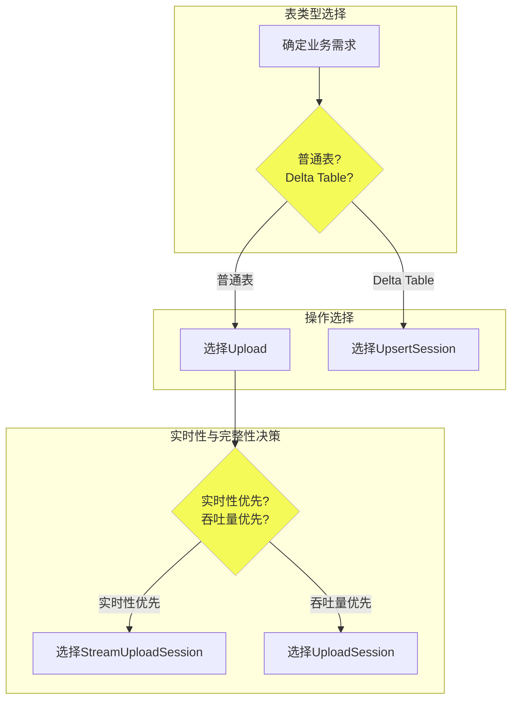

# TableTunnel 文档

## 概述

`TableTunnel` SDK 提供了高效、灵活的数据上传功能，以满足不同场景下的数据导入需求。本指南将详细介绍如何利用 `TableTunnel` 实现数据上传，包括两种上传模式（`StreamingTunnel` 和 `BatchTunnel`）以及针对不同表类型的写入模式（`upload` 和 `upsert`）。

## 数据上传

目前，`TableTunnel` 根据[上传模式](#上传模式)，[写入模式](#写入模式)的不同，提供了三种写入类（Session）。

- `StreamUploadSession`
- `UploadSession`
- `UpsertSession`

用户可以根据业务需求选择不同的写入类，以满足不同场景下的需求。下面提供了一个快速选择写入类的流程图。





### 上传模式

#### StreamingTunnel

**特点:**
- **自动提交（Auto-commit）:** 数据写入后立即可见，适合实时或近实时的数据传输场景。
- **适用场景:** 需要快速响应和即时查看数据变更的应用，如实时数据分析、流式处理等。

#### BatchTunnel

**特点:**
- **手动提交（Commit Required）:** 数据在显式调用 commit 操作后才对查询可见，类似于文件批量处理。
- **适用场景:** 大量数据批处理作业，如定期的数据同步、ETL（提取、转换、加载）任务等。

### 写入模式

#### upload（插入/追加）

- **别名:** 也称为 `insert` 或 `append`。
- **适用表类型:** MaxCompute 普通表（无主键约束）。
- **描述:** 简单地向表中追加新数据行，不考虑现有数据。适用于需要收集新增数据而无需考虑数据是否存在的情况。

#### upsert（更新/插入）

- **包含语义:** 结合了 `update` 和 `insert` 的特性。
- **适用表类型:** MaxCompute Delta Table（事务性表，具有主键约束）。
- **描述:** 当写入数据的主键与表中已有的记录匹配时，将更新该记录；如果主键不存在，则执行插入操作。此模式特别适合需要维护数据最新状态的场景，如用户信息更新、库存管理等。此外，`upsert` 还支持通过指定主键进行数据删除操作，进一步增强了数据管理的灵活性。

### 使用建议

- 根据目标表的类型（普通表或Delta Table）及业务逻辑（是否需要更新已有记录）来决定采用 `upload` 或 `upsert` 写入模式。
- 明确您的业务需求是偏向实时性还是吞吐量，以此来决定使用 `StreamingTunnel` 或 `BatchTunnel`。
- 对于大量数据的处理，考虑使用 `BatchTunnel` 以减少网络交互次数和优化整体效率。
- 在实施 `upsert` 操作前，确保对表的主键设计有充分理解，以避免数据冲突和不必要的性能开销。

**目前 upsert 写入模式还不支持 `StreamingTunnel`。**


## 数据下载
### 待完善

## 初始化
### 待完善

在使用 `TableTunnel` 之前，需要进行初始化操作，包括设置访问ID、访问密钥、ODPS和Tunnel的端点等。

```java
Account account = new AliyunAccount("<your access id>", "<your access key>");
Odps odps = new Odps(account);
odps.setEndpoint("<your odps endpoint>");
odps.setDefaultProject("<your project>");
TableTunnel tunnel = new TableTunnel(odps);
tunnel.setEndpoint("<your tunnel endpoint>");
```
