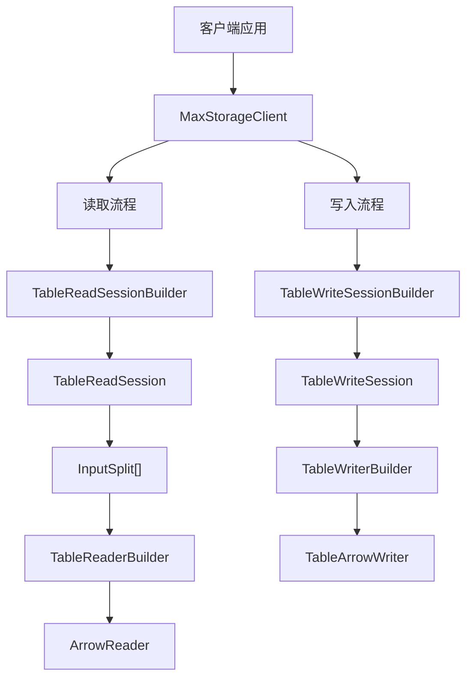

# Storage API 高性能读写模块

`odps-sdk-storage-api` 是专为高性能数据读写设计的模块，基于 [Apache Arrow](https://arrow.apache.org/) 列式内存格式，提供高效的数据传输能力。相比传统 Tunnel 接口，Storage API 具备更低的序列化开销和更好的并行处理能力，适合大规模数据批量导入导出场景。

## Maven 依赖

```xml
<dependency>
    <groupId>com.aliyun.odps</groupId>
    <artifactId>odps-sdk-storage-api</artifactId>
    <version>${odps.sdk.version}</version>
</dependency>
```

## 核心功能

| 特性 | 说明 |
|------|------|
| **高性能** | 基于 Apache Arrow 列式格式，减少序列化/反序列化开销 |
| **并行读写** | 支持将数据切分为多个 Split，并行读取或写入 |
| **事务性写入** | 批量（Batch）模式下写入为原子操作，提交后才对外可见 |
| **流式写入** | Streaming 模式下数据 flush 后立即可见，无需显式提交 |
| **列裁剪** | 读取时可指定所需列，减少网络传输量 |
| **分区过滤** | 读取时可指定分区，按需加载数据 |
| **服务端过滤** | 支持下推过滤谓词，减少数据传输量 |
| **增量读取** | 支持增量读取模式，读取表数据的增量变化 |

## 架构概览



## 核心类

| 类 | 说明 |
|------|------|
| `MaxStorageClient` | 客户端入口，线程安全，建议全局复用长期持有 |
| `TableReadSessionBuilder` | 构建表读取 Session 的 Builder，支持列裁剪和分区过滤 |
| `TableReadSession` | 表读取 Session，包含分片信息和 Schema |
| `ArrowReader` | Arrow 格式数据读取器，逐批次读取 VectorSchemaRoot |
| `TableWriteSessionBuilder` | 构建表写入 Session 的 Builder，支持选择写入模式 |
| `TableWriteSession` | 表写入 Session，管理事务生命周期 |
| `TableArrowWriter` | Arrow 格式写入器，将 VectorSchemaRoot 写入服务端 |
| `TableIdentifier` | 表标识，包含项目名和表名 |

## 配置

### 客户端构建

```java
MaxStorageClient client = MaxStorageClient.builder()
    .endpoint("https://service.cn-hangzhou.maxcompute.aliyun.com/api")
    .credentialsProvider(credentialsProvider)
    .build();
```

### 线程安全说明

| 组件 | 线程安全性 | 使用建议 |
|------|-----------|----------|
| `MaxStorageClient` | 线程安全 | 全局复用，适合作为单例 |
| `TableReadSession` / `TableWriteSession` | 非线程安全 | 每个操作使用独立实例 |
| `ArrowReader` / `TableArrowWriter` | 非线程安全 | 每个线程独立使用 |

### 资源管理

所有 Session、Reader、Writer 均实现了 `AutoCloseable` 接口，推荐使用 `try-with-resources` 语法：

```java
try (TableReadSession session = client.createTableReadSessionBuilder(tableId).build();
     ArrowReader reader = session.createReaderBuilder(splits.get(0)).build()) {
    // 使用 reader
}
// 自动关闭 reader 和 session
```

## 使用示例

### 读取表数据

```java
// 1. 构建客户端
MaxStorageClient client = MaxStorageClient.builder()
    .endpoint("https://service.cn-hangzhou.maxcompute.aliyun.com/api")
    .credentialsProvider(credentialsProvider)
    .build();

// 2. 创建读取 Session
TableIdentifier tableId = TableIdentifier.of("my_project", "my_table");
TableReadSession session = client.createTableReadSessionBuilder(tableId)
    .withColumns(Arrays.asList("id", "name", "age"))
    .build();

// 3. 获取 Splits 并行读取
List<InputSplit> splits = session.getSplits();
for (InputSplit split : splits) {
    try (ArrowReader reader = session.createReaderBuilder(split).build()) {
        while (reader.loadNextBatch()) {
            VectorSchemaRoot root = reader.getVectorSchemaRoot();
            System.out.println("读取行数: " + root.getRowCount());
        }
    }
}
```

### 写入表数据（批量模式）

```java
// 1. 构建客户端
MaxStorageClient client = MaxStorageClient.builder()
    .endpoint("https://service.cn-hangzhou.maxcompute.aliyun.com/api")
    .credentialsProvider(credentialsProvider)
    .build();

// 2. 创建写入 Session（批量模式）
TableIdentifier tableId = TableIdentifier.of("my_project", "my_table");
try (TableWriteSession session = client.createTableWriteSessionBuilder(tableId).build()) {
    // 3. 创建 Writer
    try (ArrowWriter writer = session.createWriterBuilder("stream-1", 1).build()) {
        VectorSchemaRoot root = ((TableArrowWriter) writer).createVectorSchemaRoot();
        try {
            // 填充数据并写入
            // ... 填充 root 中的数据 ...
            writer.writeBatch(root);
            writer.flush();
        } finally {
            root.close();
        }
    }
    // 4. 提交事务，数据对外可见
    session.commit();
}
```

### 写入表数据（流式模式）

```java
TableIdentifier tableId = TableIdentifier.of("my_project", "my_table");
try (TableWriteSession session = client.createTableWriteSessionBuilder(tableId)
        .withWriteMode(WriteMode.STREAMING)
        .build()) {
    try (ArrowWriter writer = session.createWriterBuilder("stream-1", 1).build()) {
        // flush 后数据立即可见，无需 commit
        writer.writeBatch(root);
        writer.flush();
    }
    // Streaming 模式无需显式 commit
}
```

## 相关文档

- [Storage API 详细文档](../api-reference/storage-api/overview.md)
- [MaxStorageClient](../api-reference/storage-api/client.md)
- [读取操作](../api-reference/storage-api/read.md)
- [写入操作](../api-reference/storage-api/write.md)
- [Tunnel 模块](./tunnel.md) - 传统数据通道方案对比
